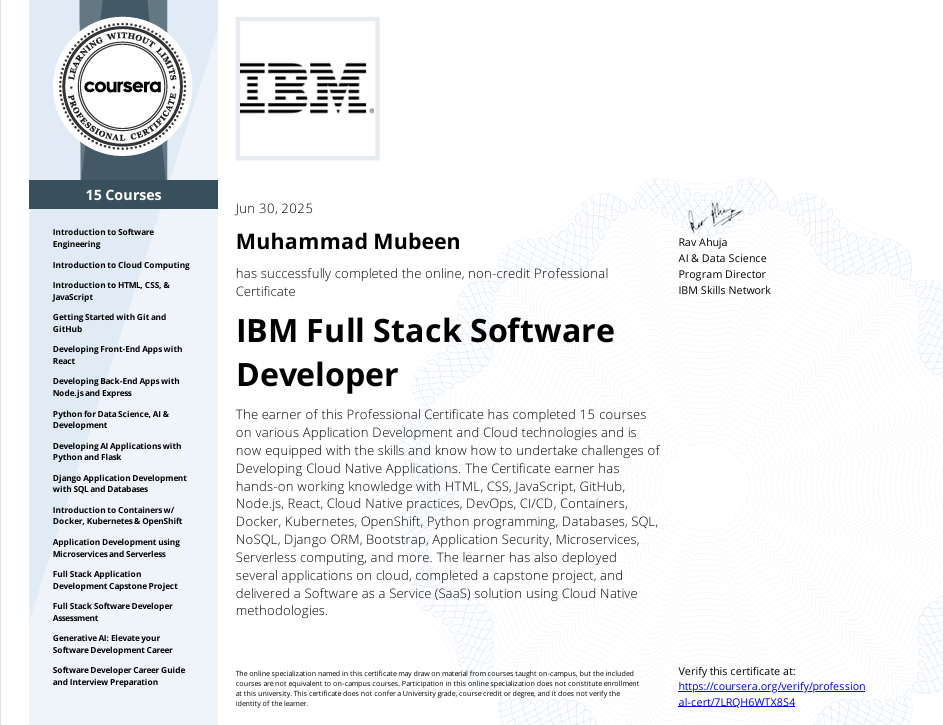

# 👋 Hello, I’m Muhammad Mubeen Blouch

<!--
**Mubeen-Baloch/Mubeen-Baloch** is a ✨ _special_ ✨ repository because its `README.md` (this file) appears on your GitHub profile.

Here are some ideas to get you started:

- 🔭 I’m currently working on ...
- 🌱 I’m currently learning ...
- 👯 I’m looking to collaborate on ...
- 🤔 I’m looking for help with ...
- 💬 Ask me about ...
- 📫 How to reach me: ...
- 😄 Pronouns: ...
- ⚡ Fun fact: ...
-->
💻 **Full Stack Developer | MERN • Python • Django • Flask | AI/Automation Enthusiast | Debugging Specialist**

---

### 🚀 What I Do

I help startups and businesses launch products faster, integrate AI/automation into workflows, and scale web applications without headaches.  
Not just a coder — I act as a long-term partner, bringing engineering discipline and AI-powered problem-solving to your projects.

---

## 🧠 Core Skills & Technologies

**Frontend:**  
React.js, Redux, Next.js, TypeScript, Tailwind CSS, Material UI, responsive UI/UX, real-time dashboards

**Backend:**  
Django, Flask, Node.js, Express.js, RESTful APIs, GraphQL, JWT auth, WebSockets, payment integrations

**AI & Automation:**  
OpenAI (ChatGPT, GPT-4), LangChain, Supabase workflows, n8n automations, NLP sentiment analysis, ML-powered features

**Cloud & DevOps:**  
Docker, Kubernetes, CI/CD (GitHub Actions), serverless, scalable deployment (AWS, DigitalOcean, IBM Cloud)

**Databases:**  
PostgreSQL, MongoDB, Supabase, MySQL — schema design, optimization, migrations

---

## 📊 Tech Stack & Tools

---

## 🎓 Certifications & Achievements

- **IBM Full Stack Software Developer Professional Certificate**   
  
- Containers & Kubernetes Essentials
- Django & Flask APIs, Microservices & Serverless
- Python for AI and Application Development  

**GitHub Achievements:**  

---

## 🤝 Why Work With Me?

- Clear, proactive communication
- Clean, maintainable code
- Fast delivery without sacrificing quality
- Experience in both traditional full stack dev and cutting-edge AI/automation

---

## 📫 Connect & Collaborate

---

⭐ Like what you see? Star my repos, browse projects, or message me — I’m open to collaborations, gigs, and long-term partnerships!
